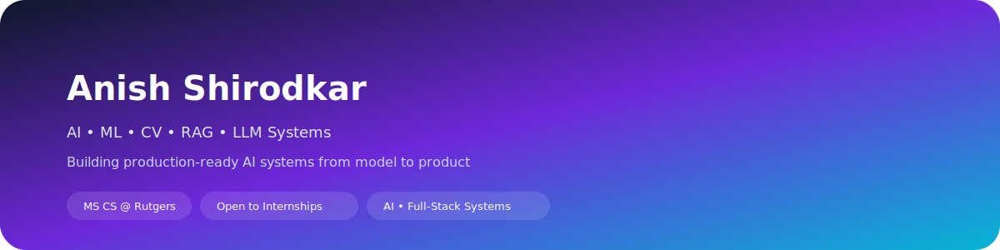
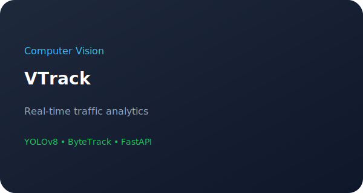
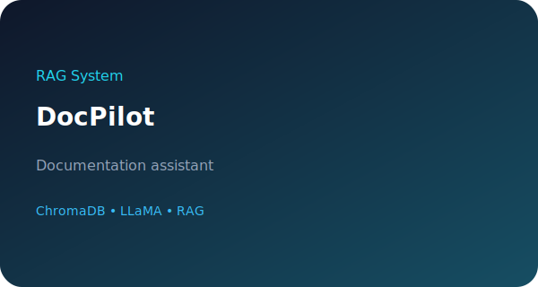
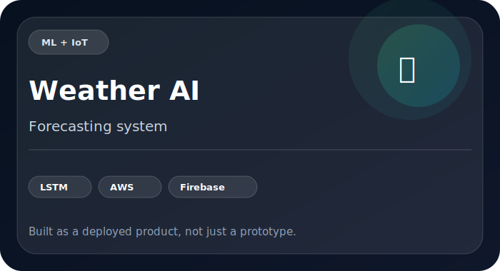

  

 

## ✦ About

I am an **AI/ML Engineer** and MS CS student at Rutgers University, focused on building production-ready AI systems that bridge the gap between complex models and real-world deployment. 

**🏆 Current Highlights:**
* **Open Source:** Actively contributing to **DeepChem** (GSoC 2026 Applicant), integrating OLMo-7B LLMs into drug discovery pipelines.
* **Research & IP:** Hold a registered patent (IP India, 2025) for an Attention-LSTM weather forecasting system built with the Indian Meteorological Department.
* **Systems Engineering:** Building scalable RAG pipelines, full-stack LLM applications (Next.js/FastAPI), and real-time Computer Vision tracking systems.

## ⚒ Tech Arsenal

  <b>Core ML & Data Science</b> 
  
  
  
  
    

  <b>LLMs & Computer Vision</b> 
  
  
  
  
  
  
    

  <b>Full-Stack & Systems Infra</b> 
  
  
  
  
  
  

## ✨ Featured Work

<table border="0">
  <tr>
    <td width="50%" valign="top">
      
       
      <b>🚗 VTrack (Real-Time Traffic Analysis)</b> 
      • ~25–30 FPS pipeline 
      • ~90–95% vehicle count accuracy 
      • YOLOv8 + ByteTrack + FastAPI
    </td>
    <td width="50%" valign="top">
      
       
      <b>🧠 SkillGap (AI Career Assistant)</b> 
      • Resume ↔ Job matching AI 
      • Multi-turn AI interview simulator 
      • Gemini API + Next.js + Supabase
    </td>
  </tr>
  <tr>
    <td width="50%" valign="top">
      
       
      <b>📄 DocPilot (RAG System)</b> 
      • 500+ pages indexed & chunked 
      • Grounded semantic retrieval 
      • ChromaDB + LLaMA + LangChain
    </td>
    <td width="50%" valign="top">
      
       
      <b>🌦 Weather AI (Forecasting System)</b> 
      • <b>Patent-backed</b> ML System (IP India, 2025) 
      • IoT → Cloud data pipeline 
      • Attention-based LSTM Models
    </td>
  </tr>
</table>

## 📈 GitHub Analytics

  

## 🤝 Connect

  
  

 

<b>Building AI systems that actually ship.</b>

